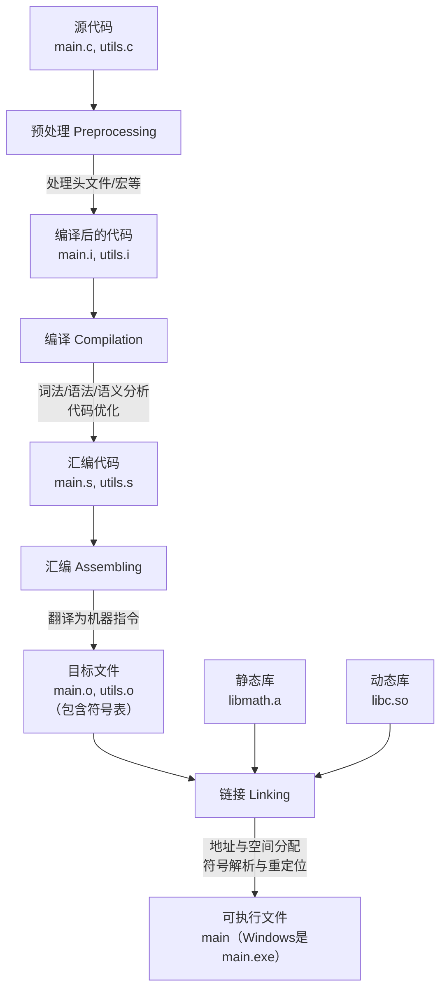

# 一、编译与链接

程序的**编译**和**链接**过程是一个将人类可读的源代码（如C/C++）转换为计算机可执行的二进制程序的关键过程。理解这个过程，对于解决复杂的编程错误、进行性能优化和深入理解计算机系统都至关重要。

我们可以把整个过程想象成出版一本书：

*   **源代码** = 你手写的手稿（`.c`, `.cpp`文件）。
*   **编译** = 编辑和排版人员将每一章手稿排版成统一的清样（`.o`或`.obj`目标文件）。
*   **链接** = 出版社将所有的章节清样、目录、插图、索引合并起来，生成最终的书籍（可执行文件，如`.exe`或二进制文件）。

---

## 1.1 整体流程概览

整个过程通常由四个核心步骤组成，但开发者通常使用一个命令（如 `gcc main.c -o main`）来触发所有步骤。编译器驱动（如 `gcc` 或 `clang`）在背后为我们按顺序执行了这些步骤。

1.  **预处理**
2.  **编译**
3.  **汇编**
4.  **链接**

下图清晰地展示了从源代码到可执行文件的完整流程及每个步骤的输入输出：



> 下面详细解析每一个步骤。

---

### 第一步：预处理

在这个阶段，编译器会处理源代码中以 `#` 开头的**预处理指令**。

**主要工作：**

1.  **头文件包含**：`#include <stdio.h>`
    *   找到指定的头文件（如 `stdio.h`），并将其**完整内容**复制到 `#include` 指令所在的位置。这就是为什么你可以在代码中使用 `printf` 等函数的原因。
2.  **宏展开**：`#define PI 3.14159`
    *   将代码中所有出现宏名（如 `PI`）的地方，替换成其定义的值（`3.14159`）。复杂的宏函数也会被展开。
3.  **条件编译**：`#if`, `#ifdef`, `#ifndef`, `#else`, `#elif`, `#endif`
    *   根据条件决定哪些代码块参与编译。这在编写跨平台代码或调试时非常有用。
4.  **删除注释**：将源代码中的所有注释（`//`, `/* ... */`）去除。

**输入文件**：`.c`, `.cpp` 等源代码文件。
**输出文件**：`.i` 文件（预处理后的文件）。你可以使用 `gcc -E main.c -o main.i` 来查看预处理后的结果。这个文件通常非常庞大，因为它包含了所有被引入的头文件内容。

**目的**：生成一个“纯净”的、没有预处理指令的C/C++代码文件，供下一步的编译使用。

---

### 第二步：编译

这是整个过程中最复杂、最核心的一步。编译阶段将预处理后的 `.i` 文件**转换为特定于目标处理器的汇编代码**（`.s` 文件）。

**主要工作（可以细分为多个子阶段）：**

1.  **词法分析**
    *   将源代码的字符序列“切割”成一系列的**记号**，比如关键字、标识符、常量、运算符等。同时，会创建一个符号表来记录这些记号。
2.  **语法分析**
    *   根据编程语言的语法规则，将词法分析产生的记号流组织成一棵**抽象语法树**。这个阶段会检查程序是否符合语法规范，例如括号是否匹配、表达式是否正确等。
3.  **语义分析**
    *   检查程序是否具有语义上的正确性。例如，进行类型检查（能否将整数赋值给字符串变量？）、变量是否已声明等。这是一个**静态分析**的过程。
4.  **中间代码生成与优化**
    *   编译器可能会先生成一种与具体硬件无关的中间代码（如三地址码），然后对其进行各种优化，比如删除无用代码、常量折叠、循环优化等，以提高程序的运行效率。
5.  **代码生成**
    *   将优化后的中间代码转换**为目标机器的汇编代码**（`.s` 文件）。

**输入文件**：`.i` 文件。
**输出文件**：`.s` 文件（汇编语言文件）。可以使用 `gcc -S main.i -o main.s` 生成。

**目的**：将高级语言转换为低级、与硬件相关的汇编语言，为下一步的汇编做准备。

---

### 第三步：汇编

汇编是一个相对简单的过程。汇编器将上一步生成的**汇编代码**（`.s` 文件）**翻译成机器可以直接执行的指令**，即**机器码**，并打包成**目标文件**（`.o` 或 `.obj` 文件）。

**主要工作：**

*   几乎是一对一地将每一条汇编语句翻译成对应的二进制机器指令。
*   将代码和数据分别整理到不同的**段**中。

**输入文件**：`.s` 文件。
**输出文件**：`.o` 或 `.obj` 文件（目标文件）。

**目标文件的结构（非常重要）：**
目标文件包含了几乎所有的机器指令和数据，但它还不是一个完整的可执行程序。它主要包含以下几个部分：
*   **代码段**：存放编译后的机器指令。
*   **数据段**：存放初始化了的全局变量和静态变量。
*   **BSS段**：存放未初始化的全局变量和静态变量（只记录大小，不占文件空间）。
*   **符号表**：这是链接的关键！它记录了在这个目标文件中**定义**的符号（如函数名、全局变量名）和**引用**了但未在此定义的符号（如调用了外部的函数 `printf`）。

**目的**：生成包含机器码和元数据（符号表）的目标文件，为链接做准备。

---

### 第四步：链接

这是从“零件”到“成品”的最后一步。链接器将**一个或多个目标文件**和**所需的库文件**组合在一起，解决它们之间的相互引用，最终生成一个单一的、可加载执行的可执行文件。

**为什么需要链接？**
在一个 `main.c` 文件中，你调用了 `printf` 函数，但 `printf` 函数的实现并不在 `main.o` 中，而是在C语言的标准库中（如 `libc.a` 或 `libc.so`）。编译 `main.c` 时，编译器只知道 `printf` 这个符号被引用了，但不知道它的具体地址。链接器的任务就是找到这个符号，并将其与 `main.o` 正确地“连接”起来。

**主要工作：**

1.  **地址和空间分配**
    *   链接器将所有输入的目标文件合并在一起。它会为每个文件的代码段、数据段等分配在最终内存空间中的**运行时地址**。
2.  **符号解析**
    *   这是链接器的核心任务之一。链接器会检查所有的目标文件和库，为每一个**符号引用**（如 `printf`）找到对应的**符号定义**（即 `printf` 函数的实际代码在哪里）。如果找不到任何一个符号的定义，就会报出著名的 **“undefined reference”** 错误。
3.  **重定位**
    *   在编译和汇编阶段，生成的机器指令中的地址很多都是临时的或从0开始的。现在，链接器知道了每个符号和段的最终内存地址，它会**修改所有对这些地址的引用**，将它们更新为正确的最终地址。这个过程就是重定位。

**库的链接：**
*   **静态链接**：在链接时，将库文件的代码**完整地复制**到最终的可执行文件中。
    *   **优点**：可执行文件独立，运行时不再依赖库。
    *   **缺点**：文件体积大，多个程序重复占用内存，库更新需要重新编译程序。
    *   **文件**：在Linux下是 `.a` 文件，在Windows下是 `.lib` 文件。
*   **动态链接**：在链接时，只在可执行文件中记录需要哪个库，而不复制代码。程序运行时，由操作系统的动态链接器将所需的库加载到内存，并与程序连接。
    *   **优点**：可执行文件小，节省磁盘和内存，库更新方便（无需重新编译程序）。
    *   **缺点**：程序运行时依赖库的存在，如果库版本不兼容可能导致问题。
    *   **文件**：在Linux下是 `.so` 文件，在Windows下是 `.dll` 文件。

**输入文件**：多个 `.o` 目标文件、静态库、动态库。
**输出文件**：可执行文件（如 `a.out`, `main.exe`）。

---

### 总结

| 步骤 | 主要工具 | 输入文件 | 输出文件 | 核心任务 |
| :--- | :--- | :--- | :--- | :--- |
| **预处理** | 预处理器 | `.c`, `.cpp`, `.h` | `.i` | 展开头文件、宏、条件编译 |
| **编译** | 编译器 | `.i` | `.s` | 语法/语义分析、优化、生成汇编代码 |
| **汇编** | 汇编器 | `.s` | `.o`/`.obj` | 将汇编代码翻译为机器码，生成目标文件 |
| **链接** | 链接器 | `.o` + 库文件 | 可执行文件 | 合并目标文件、解析符号、重定位地址 |

## 1.2 编译器（GCC，LLVM，ELF，Clang）
好的，我们来详细介绍一下 GCC、ELF、Clang 和 LLVM 这几个在 C/C++ 开发中至关重要的概念。我会先解释它们是什么，然后说明它们之间的关系。

---

### 1.2.1 GCC - GNU 编译器集合

**是什么？**
GCC 的全称是 **GNU Compiler Collection**（GNU 编译器集合）。它最初只是一个 C 编译器，但现在已经发展成为一个支持多种编程语言（如 C, C++, Objective-C, Fortran, Ada, Go 等）的编译器套件。

**核心特点：**
*   **历史悠久且稳定**：GCC 是自由软件基金会 GNU 项目的基石之一，诞生于 1987 年，非常成熟、稳定，被广泛用于各种领域。
*   **跨平台**：支持几乎所有的主流处理器架构和操作系统。
*   **自由软件**：遵循 GPL 许可证，是开源世界的典范。
*   **事实标准**：在 Linux 系统上，它是默认的编译器，也是许多开源项目的编译基石。

**工作方式：**
GCC 是一个“ monolithic ”（单体）的编译器。虽然它的内部也分前端、后端，但这些部分紧密耦合在一起。当你使用 `gcc` 或 `g++` 命令时，它会在背后调用预处理器、编译器、汇编器和链接器，完成从源代码到可执行文件的整个流程。

**简单来说：** GCC 是一个功能强大、应用广泛的**编译器驱动程序**，它统领了从源代码到可执行文件的整个构建过程。

---

### 1.2.2 ELF - 可执行与可链接格式

#### **是什么？**
ELF 的全称是 **Executable and Linkable Format**（可执行与可链接格式）。它是一种**文件格式的标准**，用于定义二进制文件应该如何组织。

---

#### 1. 它用于哪些文件？
在 Linux 和大多数类 Unix 系统中，以下文件通常都是 ELF 格式：
*   **可执行文件**：你通过 `gcc -o main main.c` 编译出来的 `main` 文件。
*   **目标文件**：编译过程中产生的 `.o` 文件。
*   **共享库**：`.so` 文件（动态链接库）。
*   **核心转储**：程序崩溃时产生的 core dump 文件。

#### 2. ELF文件的结构：
ELF 文件包含了一个文件头和一些节段。
*   **ELF Header**：描述了整个文件的组织结构，比如目标架构、程序入口地址、Section Header Table 和 Program Header Table 的位置等。
*   **Sections**：主要用于**链接**。它包含了代码、数据、符号表、字符串表等，方便链接器理解和使用这个文件。
    *   `.text`：存放已编译程序的**机器代码**。
    *   `.data`：存放已初始化的**全局变量和静态变量**。
    *   `.bss`：存放未初始化的全局变量和静态变量（这个段在文件中不占空间，只是一个占位符）。
    *   `.rodata`：存放**只读数据**，比如字符串常量。
*   **Segments**：主要用于**程序加载和执行**。一个 Segment 包含一个或多个 Section。当操作系统加载程序时，它不关心具体的 Section，而是根据 Program Header Table 将不同的 Segment 加载到内存的不同区域（例如，可读可执行的代码段，可读可写的数据段）。

---

> **简单来说：** ELF 是 Linux/Unix 世界里的“包装箱标准”。它规定了编译产生的目标文件、库文件和最终的可执行文件应该如何“打包”，以便链接器和操作系统能够正确地处理它们。**GCC 编译输出的文件，默认就是 ELF 格式。**

---

### 1.2.3 LLVM - 底层虚拟机

#### 是什么？
LLVM 的全称最初是 **Low Level Virtual Machine**，但现在这个名字已经只是项目本身的称呼，不再代表具体含义。LLVM 是一个**编译器基础设施**项目，它本身不是一个直接面向用户的编译器。

#### 核心思想：
LLVM 的核心设计是提供一个**可重用的、模块化的**编译器和工具链组件集合。其核心创新在于 **LLVM 中间表示**。

*   **LLVM IR**：这是一种与任何具体编程语言和硬件都无关的、低级的、类似汇编的中间代码。它是整个 LLVM 架构的支柱。
    *   前端将源代码转换为 LLVM IR。
    *   所有的优化都在 LLVM IR 上进行。
    *   后端将优化后的 LLVM IR 转换为目标机器的汇编代码。

**LLVM 的优势：**
*   **模块化**：如果你想创建一种新的编程语言，你只需要写一个将你的语言编译到 LLVM IR 的**前端**。
*   **强大的优化**：LLVM 提供了一套统一且强大的优化器，可以对 LLVM IR 进行优化。任何使用 LLVM 的语言都能立即享受到这些优化。
*   **支持多目标**：LLVM 支持多种 CPU 架构（x86, ARM, RISC-V等）。为 LLVM 写一个后端，你的新语言就能在所有支持的架构上运行。

**简单来说：** LLVM 是一个现代化的、模块化的**编译器“工具箱”**。它不直接编译 C/C++，而是提供了一套通用的框架，让创建编译器变得更容易。

---

### 1.2.4 Clang - C 语言家族编译器

#### **是什么？**
Clang 是一个基于 LLVM 架构构建的 C、C++、Objective-C 和 Objective-C++ 语言的**编译器前端**。

---

#### **它与 GCC 和 LLVM 的关系：**

*   **Clang 是 GCC 的竞争对手**：它的目标就是提供一个替代 GCC 的编译器，尤其在 C++ 编译领域。
*   **Clang 是 LLVM 项目的一部分**：它充当了 LLVM 的 C/C++ 家族语言**前端**。它的工作是将 C/C++ 源代码转换为 LLVM IR，然后交给 LLVM 的后端去优化和生成机器码。

---

#### **Clang 的优势：**
*   **编译速度快**：通常比 GCC 编译得更快，内存占用更少。
*   **内存占用低**。
*   **更友好的错误和警告信息**：Clang 的错误提示非常清晰，经常会指出错误的具体位置，并给出修改建议。
*   **模块化设计**：基于 LLVM 的模块化架构，易于集成到 IDE 中（这正是 Apple 资助开发 Clang 的主要原因，用于 Xcode）。
*   **BSD 许可证**：比 GCC 的 GPL 许可证限制更少，方便商业软件集成。

---

#### **工作流程：**
`C/C++ Source Code` -> **Clang（前端）** -> `LLVM IR` -> **LLVM Optimizer & Backend** -> `Machine Code`

---

### 1.2.5 总结

为了更清晰地理解它们的关系，我们可以看一个对比表格和流程图：

| 概念 | 类别 | 主要作用 | 类比 |
| :--- | :--- | :--- | :--- |
| **GCC** | 编译器套件 | 将源代码编译成机器码的完整工具链 | 一条**高度集成的自动化汽车生产线** |
| **ELF** | 文件格式 | 定义目标文件、可执行文件、库文件的组织方式 | **汽车零部件的包装和装配标准** |
| **LLVM** | 编译器基础设施 | 提供模块化的编译器组件（优化器、后端等） | 一套**通用的、可定制的汽车制造工具和引擎平台** |
| **Clang** | 编译器前端 | 将 C/C++ 代码转换为 LLVM IR | **专门为 LLVM 平台设计的、高效的汽车车身和内饰制造车间** |

**关系解读：**

*   **GCC 和 Clang/LLVM 是两套不同的编译工具链**，但它们可以产生相同格式的输出（ELF 文件）。
*   **Clang 依赖于 LLVM**，没有 LLVM 的后端，Clang 无法生成机器码。
*   **LLVM 不依赖于 Clang**，它可以与其他前端（如 Rust 的 `rustc`、Haskell 的 `GHC` 等）配合工作。
*   **GCC 和 Clang/LLVM 都生成 ELF 文件**（在 Linux 平台上）。ELF 是它们共同的目标文件格式标准。

---

# 二、文件格式

## 2.1 总概


> - .c：C 源文件 
> - .cc/.cxx/.cpp：C++ 源文件 
> - .i：经过预处理的 C 源文件 
> - .s/.S：汇编语言源文件 
> - .h：头（header）文件 
> - .o：目标（object）文件 
> - .a/.so：编译后的静态库（archive）文件和共享库 （shared object）文件 
> - a.out：可执行文件

---

## 2.2 `.c` —— C 源文件（Source File）

* **内容**：
  由程序员编写的 C 语言源代码，包含函数定义、变量声明、宏、注释等。
  通常会通过 `#include` 引入头文件 `.h`。

* **作用**：
  编译过程的起点，编译器会从这里开始。

* **典型示例：**

  ```c
  #include <stdio.h>

  int main() {
      printf("Hello, world!\n");
      return 0;
  }
  ```

* **生成下一个阶段（预处理）**：

  ```bash
  gcc -E hello.c -o hello.i
  ```

---

## 2.3 `.i` —— 预处理后的源文件（Preprocessed Source）

* **内容**：
  `.i` 文件是 **预处理器（Preprocessor）** 处理 `.c` 文件后的结果。
  预处理器会执行以下操作：

  1. 展开所有 `#include`（把头文件内容直接插入进来）
  2. 替换所有 `#define` 宏定义
  3. 处理条件编译指令（`#ifdef`, `#ifndef`, `#endif` 等）
  4. 删除注释

* **结果特点：**

  * 文件非常长，宏已展开，不再有人类可读性。
  * 编译器编译的其实就是 `.i` 内容（它不再依赖外部头文件）。

* **生成命令：**

  ```bash
  gcc -E hello.c -o hello.i
  ```

* **作用：**
  便于调试预处理宏问题。

---

## 2.4 `.s` / `.S` —— 汇编源文件（Assembly Source）

* **`.s`**：纯汇编文件（不会再进行预处理）

* **`.S`**：汇编文件，但会先经过 C 预处理（可以用宏）

* **来源**：

  * 编译器把 `.i` 翻译成汇编语言后生成。
  * 或者由程序员手写汇编。

* **命令生成：**

  ```bash
  gcc -S hello.c -o hello.s
  ```

* **内容示例（x86 架构下可能像这样）**：

  ```asm
  .file   "hello.c"
  .text
  .globl  main
  main:
      pushq   %rbp
      movq    %rsp, %rbp
      leaq    .LC0(%rip), %rdi
      call    printf
      movl    $0, %eax
      popq    %rbp
      ret
  .LC0:
      .string "Hello, world!\n"
  ```

* **用途**：
  汇编器（`as`）会把 `.s` 翻译成机器码（`.o`）。

---

## 2.5 `.h` —— 头文件（Header File）

* **内容**：
  函数声明、宏定义、结构体定义、全局变量声明等。
  **不直接编译**，只在编译 `.c` 时被 `#include` 引入。

* **作用：**

  * 实现“声明与定义分离”
  * 让多个 `.c` 文件可以共享接口定义

* **示例：**

  ```c
  // math_utils.h
  int add(int a, int b);
  ```

  ```c
  // math_utils.c
  #include "math_utils.h"
  int add(int a, int b) {
      return a + b;
  }
  ```

---

## 2.6 `.o` —— 目标文件（Object File）

* **内容**：
  二进制文件，由汇编器（`as`）把 `.s` 翻译成机器指令并生成。
  格式一般为 **ELF（Executable and Linkable Format）**。

* **特征：**

  * 包含：

    * 机器指令（`.text`）
    * 数据（`.data`, `.bss`）
    * 符号表（symbol table）
    * 重定位信息（relocation）
  * 不能直接运行（地址未固定，等待链接器处理）

* **生成命令：**

  ```bash
  gcc -c hello.c -o hello.o
  ```

* **查看内容：**

  ```bash
  nm hello.o        # 符号表
  objdump -d hello.o  # 反汇编
  readelf -S hello.o  # 节区信息
  ```

* **作用：**
  这是“可重定位代码单元”，会被链接器组合成最终程序。

---

## 2.7 `.a` —— 静态库（Static Library）

* **内容**：
  `.a` 文件其实是很多 `.o` 文件的打包（归档）。

* **创建命令：**

  ```bash
  ar rcs libmath.a add.o sub.o mul.o
  ```

* **作用：**

  * 链接时，链接器从 `.a` 里取出需要的目标文件。
  * 所有用到的代码会被拷贝进最终可执行文件。

* **特点：**

  * 链接时体积大，但运行时无需额外文件。
  * 典型系统库如 `/usr/lib/libm.a`。

---

## 2.8 `.so` —— 共享库（Shared Object）

* **内容**：
  动态链接库（Dynamic Link Library）。
  与 `.a` 类似，但不会在编译时拷贝进去，而是在运行时动态加载。

* **生成命令：**

  ```bash
  gcc -shared -fPIC -o libmath.so add.o sub.o mul.o
  ```

* **特点：**

  * 节省空间，多个程序可共享同一个 `.so`。
  * 程序运行时由动态链接器加载（`ld.so`）。
  * 可以更新库而不重新编译整个程序。

* **示例：**
  `/lib/x86_64-linux-gnu/libc.so.6` 就是系统 C 标准库。

---

## 2.9 `a.out` —— 可执行文件（Executable File）

* **名字由来**：
  “assembler output”的缩写。早期 Unix 默认编译输出文件名就是 `a.out`。

* **内容**：
  由 **链接器（linker）** 把所有 `.o`、`.a`、`.so` 组合、重定位、解析符号后生成的 **可执行程序**。
  格式同样是 ELF（Linux）。

* **生成命令：**

  ```bash
  gcc hello.o -o hello    # 自定义输出名
  # 或者省略 -o，则默认生成 a.out
  gcc hello.o             # 输出 a.out
  ```

* **运行：**

  ```bash
  ./a.out
  ```

* **查看依赖库：**

  ```bash
  ldd a.out
  ```

* **结构：**
  包含程序头表（program headers）、节（sections）、符号表、入口点（entry point），可以直接由操作系统加载执行。

---

## 2.10 完整编译链接流程总结图

```text
hello.c (源代码)
   │
   ├───► 预处理 → hello.i
   │
   ├───► 编译 → hello.s （汇编）
   │
   ├───► 汇编 → hello.o （目标文件）
   │
   ├───► 链接静态库/动态库 → a.out （可执行文件）
   │
   └───► (多个 .o 打包成 .a / 生成 .so)
```

---

## 2.11 总结表

| 文件名后缀       | 类型    | 生成工具            | 是否可执行 | 内容简述       |
| ----------- | ----- | --------------- | ----- | ---------- |
| `.c`        | C 源文件 | 手动编写            | ❌     | C 语言源代码    |
| `.h`        | 头文件   | 手动编写            | ❌     | 函数/宏声明     |
| `.i`        | 预处理文件 | 预处理器（cpp）       | ❌     | 展开宏、头文件后的源 |
| `.s` / `.S` | 汇编源文件 | 编译器（gcc -S）或手写  | ❌     | 汇编指令       |
| `.o`        | 目标文件  | 汇编器（as）         | ❌     | 机器码+符号表    |
| `.a`        | 静态库   | ar              | ❌     | 打包的 `.o`   |
| `.so`       | 动态库   | 链接器（ld -shared） | ✅（共享） | 动态加载的库     |
| `a.out`     | 可执行文件 | 链接器（ld/gcc）     | ✅     | 最终程序（ELF）  |

---

# 三、GCC指令

## 3.1 GCC 简介

GCC（GNU Compiler Collection）是 GNU 提供的编程语言编译器集合，最常用的 C/C++ 编译器。在 Linux 系统中，GCC 可以完成从源代码到可执行文件的整个编译流程，包括预处理、编译、汇编、链接。

---

## 3.2 GCC 基本使用格式

```bash
gcc [选项] [源文件] [目标文件] [-o 输出文件]
```

* `[源文件]`：需要编译的 `.c` 或 `.cpp` 文件
* `-o 输出文件`：指定生成的可执行文件名
* `[选项]`：控制编译方式或生成的目标类型

**示例：**

```bash
gcc hello.c -o hello
```

生成可执行文件 `hello`。

---

## 3.3 GCC 编译流程分阶段

GCC 编译源文件大体分为四个阶段，每个阶段可以单独执行：

1. **预处理（Preprocessing）**

   * 指令：`gcc -E source.c -o source.i`
   * 功能：处理宏定义、`#include` 头文件、条件编译
   * 输出：扩展后的纯 C 代码 `.i` 文件

2. **编译（Compilation）**

   * 指令：`gcc -S source.i -o source.s`
   * 功能：把 C 代码翻译为汇编代码
   * 输出：汇编代码 `.s` 文件

3. **汇编（Assembling）**

   * 指令：`gcc -c source.s -o source.o`
   * 功能：把汇编代码生成目标文件（机器码）
   * 输出：目标文件 `.o` 文件

4. **链接（Linking）**

   * 指令：`gcc source.o -o executable`
   * 功能：把目标文件与库文件链接生成可执行文件

**完整一条命令自动完成整个流程：**

```bash
gcc source.c -o executable
```

---

## 3.4 常用 GCC 选项

| 选项                      | 功能                      |
| ----------------------- | ----------------------- |
| `-E`                    | 仅预处理，生成 `.i` 文件         |
| `-S`                    | 仅编译，生成汇编 `.s` 文件        |
| `-c`                    | 仅汇编，生成目标 `.o` 文件        |
| `-o <file>`             | 指定输出文件名                 |
| `-Wall`                 | 打开常用警告信息                |
| `-Werror`               | 把警告当作错误处理               |
| `-g`                    | 生成调试信息，用于 gdb 调试        |
| `-O0`、`-O1`、`-O2`、`-O3` | 不同等级优化代码                |
| `-I<dir>`               | 指定头文件搜索路径               |
| `-L<dir>`               | 指定库文件搜索路径               |
| `-l<lib>`               | 链接指定库，如 `-lm` 链接 math 库 |
| `-std=c11`              | 指定 C 标准，如 C11、C99 等     |
| `-shared`               | 生成共享库（.so 文件）           |
| `-fPIC`                 | 生成位置无关代码，用于共享库          |

---

## 3.5 示例

1. **生成可执行文件并打开警告**

```bash
gcc -Wall hello.c -o hello
```

2. **生成调试信息，方便 gdb 调试**

```bash
gcc -g main.c -o main
gdb ./main
```

3. **生成汇编代码**

```bash
gcc -S main.c -o main.s
```

4. **生成目标文件，不链接**

```bash
gcc -c main.c -o main.o
```

5. **编译多个源文件并链接**

```bash
gcc main.c utils.c -o app
```

6. **链接数学库**

```bash
gcc calc.c -lm -o calc
```

---

## 3.6 查看 GCC 版本

```bash
gcc --version
```

---

## 3.7 小结

* GCC 可以单独执行编译流程的每一步，也可以一步到位生成可执行文件
* 常用选项 `-E -S -c -o -Wall -g -O` 对日常开发最有用
* 调试和优化时，灵活使用 `-g` 和 `-O` 选项非常关键

---

# 四、Binutils工具
**Binutils**（Binary Utilities）是 GNU 项目中的一个重要工具集，它提供了一系列用于处理二进制文件的工具。这些工具是编译和链接过程中不可或缺的组成部分，主要用于创建、管理和分析目标文件、库文件和可执行文件。

## 4.1 核心工具组成

Binutils 包含以下主要工具：

### 1. **ld** - GNU 链接器
- 将多个目标文件(.o)和库文件(.a, .so)链接成最终的可执行文件或共享库
- 处理符号解析、重定位和内存布局

```bash
ld -o program main.o utils.o -lc
```

### 2. **as** - GNU 汇编器
- 将汇编语言文件(.s)转换为目标文件(.o)
- 支持多种处理器架构的汇编语法

```bash
as -o hello.o hello.s
```

### 3. **ar** - 静态库创建器
- 创建和管理静态库文件(.a)
- 将多个目标文件打包成单个静态库

```bash
# 创建静态库
ar rcs libmath.a add.o sub.o mul.o

# 查看库内容
ar t libmath.a
```

### 4. **objdump** - 目标文件反汇编器
- 显示目标文件的详细信息
- 反汇编可执行代码段
- 查看符号表、段信息等

```bash
objdump -d program    # 反汇编
objdump -t program    # 显示符号表
objdump -h program    # 显示段头部
```

### 5. **nm** - 符号列表工具
- 列出目标文件中的符号（函数、变量名）
- 显示符号的类型和地址

```bash
nm main.o            # 显示符号
nm -D libc.so.6      # 显示动态符号
```

### 6. **readelf** - ELF 文件分析器
- 专门用于显示 ELF 格式文件的详细信息
- 比 objdump 更详细地显示 ELF 特定信息

```bash
readelf -h program    # 显示 ELF 头部
readelf -S program    # 显示段表
readelf -s program    # 显示符号表
readelf -d program    # 显示动态段信息
```

### 7. **strip** - 符号删除工具
- 从目标文件中删除符号表和调试信息
- 减小文件大小，用于发布版本

```bash
strip program        # 删除所有符号
strip --strip-debug program  # 只删除调试信息
```

### 8. **strings** - 字符串提取工具
- 从二进制文件中提取可打印的字符串

```bash
strings program | grep -i error
```

### 9. **size** - 段大小显示工具
- 显示目标文件各段的大小

```bash
size program
# 输出: text    data     bss     dec     hex filename
```

### 10. **addr2line** - 地址转换工具
- 将运行时地址转换为文件名和行号
- 用于调试核心转储

```bash
addr2line -e program 0x400512
```

## 4.2 实际应用示例

### 完整的编译链接过程展示
```bash
# 1. 编译C源码为汇编
gcc -S main.c -o main.s

# 2. 汇编为目标文件
as main.s -o main.o

# 3. 查看目标文件符号
nm main.o

# 4. 链接为可执行文件
ld -o program main.o -lc

# 5. 分析可执行文件
readelf -h program
objdump -d program
```

### 静态库创建和使用
```bash
# 编译多个源文件
gcc -c add.c sub.c mul.c

# 创建静态库
ar rcs libmath.a add.o sub.o mul.o

# 查看库内容
ar t libmath.a

# 使用静态库编译程序
gcc main.c -L. -lmath -o calculator
```

## 4.3 在开发中的作用

### 编译过程支持
```
源代码 → 编译器 → 汇编代码 → 汇编器 → 目标文件 → 链接器 → 可执行文件
                  (gcc)     (as)      (ld)
```

### 调试和分析
- **objdump/readelf**：分析程序结构和反汇编
- **nm**：检查符号冲突和缺失
- **addr2line**：定位崩溃地址对应的源代码位置
- **strings**：检查二进制文件中的硬编码信息

### 性能优化
- **size**：分析程序各段大小，优化内存使用
- **strip**：减少发布版本的体积

## 4.4 与 GCC 的关系

> Binutils 和 GCC 是紧密协作但独立的项目：
> - **GCC**：主要负责前端（语法分析、语义分析）和中间代码优化
> - **Binutils**：主要负责后端（汇编、链接、二进制处理）

```bash
# GCC 在内部调用 binutils 工具
gcc main.c -o program
# 实际上执行了：
#   gcc -S main.c -o main.s    (GCC)
#   as main.s -o main.o        (Binutils)
#   ld -o program main.o -lc   (Binutils)
```

## 4.5 总结

Binutils 是 Linux/Unix 开发环境中的基础工具集，为开发者提供了：
- **构建工具**（as, ld, ar）
- **分析工具**（objdump, readelf, nm）
- **优化工具**（strip, size）
- **调试工具**（addr2line, strings）。
  
---

# 五、ELF格式  

## 5.1 ELF 格式概述

### 5.1.1 什么是 ELF
- **全称**：Executable and Linkable Format（可执行与可链接格式）
- **用途**：可执行文件、目标文件、共享库、核心转储的标准格式
- **平台**：类 Unix 系统（Linux、BSD等）的事实标准

### 5.1.2 核心组件

- **文件头（ELF Header）**：描述整个ELF文件的信息
- **程序头表（Program Header Table）**：描述段（Segments），用于执行
- **节头表（Section Header Table）**：描述节（Sections），用于链接
- **数据部分**：实际的代码、数据内容

---

## 5.2 两种视图对比

### 5.2.1 运行视图（Execution View）
```
Program Header Table
↓
.text (代码)
.init (初始化代码)
.data (已初始化数据)
.bss  (未初始化数据)
...
↓
Section Header Table（可选）
```

**特点**：
- 面向**操作系统加载器**
- 按**段（Segment）** 组织
- 用于**程序执行**
- 节头表可以剥离以节省空间

---

### 5.2.2 链接视图（Linking View）
```
Program Header Table（可选）
↓
.text
.init
.data
.bss
...
↓
Section Header Table
```

**特点**：
- 面向**链接器**
- 按**节（Section）** 组织
- 用于**编译链接**
- 程序头表在纯链接中可选

## 5.3 段（Segment） vs 节（Section）

### 5.3.1 关键区别
| 特性 | 节（Section） | 段（Segment） |
|------|---------------|---------------|
| **用途** | 链接视图 | 执行视图 |
| **使用者** | 链接器、调试器 | 操作系统加载器 |
| **粒度** | 细粒度 | 粗粒度 |
| **组织** | 按功能分类 | 按内存权限分类 |

### 5.3.2 映射关系
```
节（Sections）                段（Segments）
.text   ---↘
.rodata -----→ LOAD（代码段，R-X权限）
.init   ---↗
.data   ---↘
.bss    -----→ LOAD（数据段，RW-权限）
.sdata  ---↗
```

## 5.4 程序执行时的段加载（Segment Loading）机制

### 5.4.1 程序头表结构
```c
typedef struct {
    uint32_t p_type;   // 段类型：LOAD、DYNAMIC、INTERP等
    uint32_t p_offset; // 文件内偏移量
    uint32_t p_vaddr;  // 虚拟地址
    uint32_t p_paddr;  // 物理地址
    uint32_t p_filesz; // 文件中的大小
    uint32_t p_memsz;  // 内存中的大小
    uint32_t p_flags;  // 权限标志：R/W/X
    uint32_t p_align;  // 对齐方式
} Elf32_Phdr;
```

### 5.4.2 主要段类型

| 段类型 | 描述 | 权限 | 包含内容 |
|--------|------|------|----------|
| **LOAD** | 可加载段 | R-X/RW- | 代码、数据 |
| **DYNAMIC** | 动态链接信息 | RW- | 动态符号表、重定位表 |
| **INTERP** | 解释器路径 | R-- | 动态链接器路径 |
| **NOTE** | 附加信息 | R-- | 版本信息、ABI信息 |

### 5.4.3 加载过程详解

#### 步骤1：解析程序头表
```bash
# 查看段的实际例子
readelf -l /bin/ls

# 输出示例：
Type   Offset   VirtAddr   PhysAddr   FileSiz MemSiz Flg Align
LOAD   0x000000 0x00400000 0x00400000 0x1c4e4 0x1c4e4 R E 0x200000
LOAD   0x01cdf0 0x0061cdf0 0x0061cdf0 0x00b08 0x00e38 RW  0x200000
```

#### 步骤2：映射代码段
- **文件偏移** → **虚拟地址** 映射
- 设置权限：**可读 + 可执行**
- 包含：`.text`、`.init`、`.rodata` 等节

#### 步骤3：映射数据段
- **文件偏移** → **虚拟地址** 映射  
- 设置权限：**可读 + 可写**
- 处理 `.bss`：`p_memsz > p_filesz` 时填充零

#### 步骤4：处理特殊段
- **INTERP**：加载动态链接器（如 `/lib/ld-linux.so.2`）
- **DYNAMIC**：设置动态链接信息

#### 步骤5：跳转执行
- 设置程序计数器到入口点（Entry Point）
- 开始执行程序

---

## 5.5 为什么按段加载？

### 5.5.1 内存管理优势
- **页面对齐**：按内存页（通常4KB）边界对齐
- **权限控制**：统一的段内权限控制
- **效率优化**：减少系统调用次数，提高加载速度

### 5.5.2 安全性考虑
- **W^X保护**：防止内存页同时可写和可执行
- **数据执行保护**：数据段不可执行，代码段不可写

### 5.5.3 实际效益
```c
// 错误：试图执行数据段（会被阻止）
void (*func)() = (void(*)())data_buffer;
func();  // 段错误或保护异常

// 正确：代码段可执行，数据段可写，各司其职
```

---

## 5.6 ELF 格式的优势总结

### 5.6.1 技术优势
| 优势 | 说明 |
|------|------|
| **跨平台** | 支持多种CPU架构（x86、ARM、RISC-V等） |
| **灵活性** | 支持静态链接、动态链接 |
| **扩展性** | 易于添加新的节和段类型 |
| **调试友好** | 丰富的调试信息支持 |

### 5.6.2 工程优势
- **工具链完善**：GCC、binutils、GDB 等完整支持
- **标准化**：不同厂商编译器产出兼容格式
- **可分析性**：易于反汇编、调试和分析

### 5.6.3 性能优势
- **快速加载**：段映射比逐个节加载更高效
- **内存节约**：支持节头表剥离
- **共享库**：支持代码段共享，减少内存占用

## 5.7 实际应用

### 5.7.1 查看 ELF 信息
```bash
# 查看段信息
readelf -l program

# 查看节信息  
readelf -S program

# 查看完整的ELF头
readelf -h program
```

### 5.7.2 开发注意事项
- **链接脚本**：控制节到段的映射
- **内存布局**：合理安排段地址避免冲突
- **安全编译**：利用段权限增强安全性

---

## 5.8 总结

ELF 格式通过**双视图设计**巧妙解决了编译链接与运行时加载的不同需求：

- **链接时**关注**节**的精细组织
- **运行时**关注**段**的高效加载
- **按段加载**是现代操作系统内存管理和安全保护的基石
- 这种设计使 ELF 成为 Unix/Linux 生态系统中不可或缺的基础设施

这种分离关注点的设计是 ELF 格式成功的关键，既保证了开发的灵活性，又确保了运行的效率和安全性。

---

# 六、ELF格式文件内容详细介绍

ELF 文件不仅仅是一个可执行文件，它是由多个 **节（Section）** 组成的，每个节有自己的用途。节在链接和运行时扮演不同角色。这里以32位ELF为例

---

## 6.1 常见节区概览

| 节名          | 类型       | 属性                   | 作用               | 存储位置         | 示例说明                        |
| ----------- | -------- | -------------------- | ---------------- | ------------ | --------------------------- |
| `.text`     | PROGBITS | AX (Alloc + Execute) | 存放程序机器指令         | 可执行内存        | main 函数、其他函数的机器码            |
| `.data`     | PROGBITS | WA (Alloc + Write)   | 存放已初始化的全局变量和静态变量 | 可读写内存        | `int x = 10;`               |
| `.bss`      | NOBITS   | WA (Alloc + Write)   | 存放未初始化的全局变量和静态变量 | 可读写内存，运行时被清零 | `int y;`                    |
| `.rodata`   | PROGBITS | A (Alloc + Read)     | 存放只读数据，如字符串常量    | 只读内存         | `"Hello world"`             |
| `.init`     | PROGBITS | AX                   | 程序初始化代码          | 可执行内存        | `_init` 函数，用于执行构造函数         |
| `.fini`     | PROGBITS | AX                   | 程序结束代码           | 可执行内存        | `_fini` 函数，用于析构函数           |
| `.ctors`    | PROGBITS | WA                   | 构造函数列表           | 可读写内存        | 存放 C++ 静态对象的构造函数地址          |
| `.dtors`    | PROGBITS | WA                   | 析构函数列表           | 可读写内存        | 存放 C++ 静态对象的析构函数地址          |
| `.comment`  | PROGBITS | MS (merge + string)  | 编译器/版本信息         | 非运行时使用       | `"GCC: (Ubuntu 9.4.0) ..."` |
| `.note.*`   | PROGBITS | A                    | 存放额外元信息          | 只读内存         | `.note.gnu.build-id` 等      |
| `.symtab`   | SYMTAB   | —                    | 符号表              | 链接和调试使用      | 函数、全局变量符号                   |
| `.strtab`   | STRTAB   | —                    | 字符串表             | 链接使用         | 符号名称存储                      |
| `.shstrtab` | STRTAB   | —                    | Section 名称表      | 链接使用         | 存放每个节的名字                    |

---

## 6.2 各节详细说明

### 6.2.1 `.text` 节

* **作用**：存放可执行程序的机器指令
* **属性**：AX (Alloc + Execute)，内存可执行
* **特点**：

  * 编译器生成的所有函数代码存这里
  * 静态链接后，入口点 `_start` 也在这里
* **示例**：

```asm
0000000000000000 <main>:
   0:   55                    push   %rbp
   1:   48 89 e5              mov    %rsp,%rbp
   4:   48 8d 3d 00 00 00 00  lea    0x0(%rip),%rdi
   ...
```

---

### 6.2.2 `.data` 节

* **作用**：存放**已初始化的全局变量和静态变量**
* **属性**：WA (Alloc + Write)，可读写
* **特点**：

  * 链接时分配空间并赋初值
  * 占用文件空间
* **示例**：

```c
int x = 42;
static int y = 100;
```

* 都存放在 `.data` 节

---

### 6.2.3 `.bss` 节

* **作用**：存放**未初始化的全局变量和静态变量**
* **属性**：WA (Alloc + Write)
* **特点**：

  * 文件中不占实际空间 (NOBITS)
  * 运行时内存会被自动清零
* **示例**：

```c
int a;
static int b;
```

---

### 6.2.4 `.rodata` 节

* **作用**：存放**只读数据**
* **属性**：A (Alloc)
* **特点**：

  * 字符串常量、只读数组
  * 避免被修改
* **示例**：

```c
const char *str = "Hello world";
```

* `"Hello world"` 存放在 `.rodata`

---

### 6.2.5 `.init` 和 `.fini` 节

* `.init`：程序初始化代码，执行 `_init` 函数（如 C++ 构造函数调用）
* `.fini`：程序结束代码，执行 `_fini` 函数（如 C++ 析构函数调用）
* **属性**：AX (可执行)
* **特点**：

  * 对于 C 程序常为空
  * 对于 C++ 静态对象构造析构很重要

---

### 6.2.6 `.ctors` / `.dtors`

* 用于存放 **静态对象构造和析构函数地址**
* 链接器在 `.init` 和 `.fini` 中调用这些函数
* **特点**：

  * 主要出现在 C++ 程序
  * `.ctors` 存放 `_GLOBAL__I_*` 构造函数
  * `.dtors` 存放 `_GLOBAL__D_*` 析构函数

---

### 6.2.7 `.comment`

* **作用**：存放编译器版本信息
* **属性**：MS (merge + string)
* **特点**：

  * 只在查看文件信息时有用
  * 不参与运行时

---

### 6.2.8 `.note.*`

* **作用**：存放额外元信息
* **例子**：

  * `.note.gnu.build-id` → 文件唯一 ID
  * `.note.ABI-tag` → 指示系统兼容性
* **特点**：

  * 只读
  * 链接器/调试器使用

---

### 6.2.9 符号表和字符串表

* `.symtab`：符号表，存放函数、全局变量符号
* `.strtab`：存放符号名字符串
* `.shstrtab`：存放节名字符串
* **特点**：

  * 主要用于链接和调试
  * `.symtab` + `.strtab` 对应 `nm` 或 `readelf -s` 输出

---

## 6.3 总结表（按作用分类）

| 分类        | 节名                                | 作用                 |
| --------- | --------------------------------- | ------------------ |
| **代码**    | `.text`, `.init`, `.fini`         | 存放机器指令，执行代码        |
| **数据**    | `.data`, `.bss`, `.rodata`        | 已初始化 / 未初始化 / 只读数据 |
| **构造/析构** | `.ctors`, `.dtors`                | 静态对象构造/析构函数        |
| **元信息**   | `.comment`, `.note.*`             | 编译器信息、系统 ABI 信息    |
| **链接符号**  | `.symtab`, `.strtab`, `.shstrtab` | 符号表和字符串表，调试/链接使用   |

---

# 七、本地编译和交叉编译

## 7.1 核心概念

| 类型                           | 定义                                  | 示例                                                               |
| ---------------------------- | ----------------------------------- | ---------------------------------------------------------------- |
| **本地编译（Native Compilation）** | 编译器在与目标程序相同的架构与系统上运行并生成可执行文件        | 在 x86_64 Linux 上用 `gcc hello.c -o hello`，得到的程序可直接在本机运行           |
| **交叉编译（Cross Compilation）**  | 编译器在一种架构/系统上运行，但生成供另一种架构/系统使用的可执行文件 | 在 x86_64 Linux 上用 `riscv64-unknown-elf-gcc` 编译出给 RISC-V 板运行的 ELF |

---

## 7.2 关键术语

| 术语                   | 含义                                                                        |
| -------------------- | ------------------------------------------------------------------------- |
| **build**            | 编译器所在的机器（执行编译的主机）                                                         |
| **host**             | 编译输出的可执行文件将运行的机器                                                          |
| **target**           | 仅在“编译编译器”场景中使用（编译器要为哪个架构生成代码）                                             |
| **toolchain triple** | 描述目标平台的三元组，如 `x86_64-linux-gnu`、`aarch64-linux-gnu`、`riscv64-unknown-elf` |
| **sysroot**          | 目标系统的根目录，包含头文件与库，交叉编译时必须指定                                                |

---

## 7.3 为什么要使用交叉编译

* 目标设备架构不同（如 ARM、RISC-V、MIPS 等）
* 目标系统资源有限（无法本地编译）
* 为不同操作系统或 ABI 生成二进制
* 构建嵌入式固件、内核、Bootloader 等

---

## 7.4 本地与交叉编译器区别

| 项目       | 本地编译器（gcc）                            | 交叉编译器（riscv64-unknown-elf-gcc 等） |
| -------- | ------------------------------------- | -------------------------------- |
| 编译运行环境   | 与目标相同                                 | 与目标不同                            |
| 链接库      | 本地系统库（/lib, /usr/lib）                 | 目标系统库（sysroot）                   |
| 可执行文件    | 可直接在本机运行                              | 只能在目标设备上运行                       |
| 是否支持操作系统 | 是（如 `-linux-gnu`）或否（如 `-unknown-elf`） |                                  |

---

## 7.5 常见命令示例

### ✅ 本地编译

```bash
gcc hello.c -o hello
./hello
```

### ✅ RISC-V 裸机交叉编译

```bash
riscv64-unknown-elf-gcc -march=rv64imac -mabi=lp64 -o hello.elf hello.c
```

### ✅ ARM Linux 交叉编译

```bash
aarch64-linux-gnu-gcc --sysroot=/opt/aarch64-root -o hello hello.c
```

### ✅ 为 Windows 编译（MinGW）

```bash
x86_64-w64-mingw32-gcc -o hello.exe hello.c
```

---

## 7.6 构建系统支持（autotools / CMake）

| 工具            | 关键参数                                                              |
| ------------- | ----------------------------------------------------------------- |
| **autotools** | `./configure --host=arm-linux-gnueabihf --build=x86_64-linux-gnu` |
| **CMake**     | 使用 `CMAKE_TOOLCHAIN_FILE` 或指定 `CMAKE_SYSROOT`、`CMAKE_C_COMPILER`  |

---

## 7.7 常见问题与排查

| 问题         | 原因           | 解决办法                 |
| ---------- | ------------ | -------------------- |
| ❌ 找不到头文件/库 | 没有正确 sysroot | 添加 `--sysroot`       |
| ❌ 目标运行崩溃   | ABI 不匹配      | 检查 `-mabi`、`-march`  |
| ❌ 主机无法运行   | 属于交叉编译正常现象   | 用 `qemu` 模拟或传至目标设备运行 |
| ❌ 链接错误     | 链接到主机库       | 确认库路径、交叉版本正确         |
| ❌ 第三方库冲突   | 未为目标重新编译     | 交叉编译依赖库并放入 sysroot   |

---

## 7.8 交叉编译工具链获取方式

1. **直接安装系统包**

   ```bash
   sudo apt install gcc-aarch64-linux-gnu
   ```
2. **使用 Buildroot / Yocto / Crosstool-NG 自建工具链**
3. **下载官方预编译工具链**

   * RISC-V 官方：[https://github.com/riscv-collab/riscv-gnu-toolchain](https://github.com/riscv-collab/riscv-gnu-toolchain)
   * ARM 官方：[https://developer.arm.com/downloads/-/arm-gnu-toolchain](https://developer.arm.com/downloads/-/arm-gnu-toolchain)
4. **使用 Docker 构建隔离环境**

---

## 7.9 调试与运行技巧

| 方式                     | 用途            |
| ---------------------- | ------------- |
| `qemu-aarch64 ./hello` | 在主机上运行 ARM 程序 |
| `gdb-multiarch`        | 多架构调试器        |
| `gdbserver` + `gdb`    | 主机远程调试目标设备程序  |

---

## 7.10 典型应用场景

| 场景           | 工具链                                           | 特点                 |
| ------------ | --------------------------------------------- | ------------------ |
| 嵌入式 MCU 裸机   | `arm-none-eabi-gcc`、`riscv64-unknown-elf-gcc` | 无操作系统，无 libc       |
| ARM Linux 应用 | `aarch64-linux-gnu-gcc`                       | 有 libc（glibc/musl） |
| Windows 可执行  | `x86_64-w64-mingw32-gcc`                      | 生成 .exe            |
| Linux 内核/模块  | 与目标内核版本一致的交叉编译器                               | 必须匹配内核配置           |

---

## 7.11 交叉编译前检查清单

* [ ] 使用正确的交叉编译器 triple？
* [ ] 目标架构 `-march`、ABI `-mabi` 参数正确？
* [ ] 指定了 `--sysroot` 或正确的头/库路径？
* [ ] 第三方库均已交叉编译？
* [ ] 使用 qemu 或目标设备验证运行？
* [ ] 链接器脚本、启动代码适配目标环境？

---

## 7.12 总结 

- 快速命令模板

```bash
# 基本形式
<target-triple>-gcc --sysroot=<path> -march=<arch> -mabi=<abi> -o <out> <src>

# 示例（RISC-V Linux）
riscv64-linux-gnu-gcc --sysroot=/opt/riscv-root -march=rv64gc -mabi=lp64d -O2 hello.c -o hello_rv64
```

- 总结

> **本地编译** = “为自己编译”；
> **交叉编译** = “为别人（另一平台）编译”。

---

# 八、调试器GBD和模拟器QEMU

## 8.1 GDB（GNU Debugger）

### 1 定义

* GDB 是 **GNU 调试器**，用于调试程序（尤其是 C/C++/Fortran）。
* 作用：定位程序 bug、分析程序运行行为、调试崩溃。

---

### 2. 调试对象

1. **源代码级调试**

   * 可逐行跟踪 C/C++ 源代码。
   * 需用 `-g` 编译生成调试信息：

     ```bash
     gcc -g main.c -o main
     ```
2. **可执行文件调试**

   * 可直接调试 ELF 可执行文件。
   * 可以查看汇编、寄存器、内存状态。
   * 适合分析崩溃或性能问题。

---

### 3. 核心功能

* **断点和观察点**

  * `break` 设置断点
  * `watch` 监视变量变化
* **单步执行**

  * `step` 进入函数执行
  * `next` 跳过函数逐行执行
* **查看信息**

  * `print var` 查看变量
  * `backtrace` 查看调用栈
  * `info registers` 查看寄存器
* **修改状态**

  * `set var x=10` 改变变量值
* **核心转储分析**

  * `gdb ./program core` 分析程序崩溃原因

---

### 4. 工作方式

* **运行模式**：直接调试程序 `gdb ./a.out`
* **附加模式**：调试已运行进程 `gdb -p PID`
* **交互方式**：命令行操作，实时控制程序执行

---

## 8.2 QEMU（Quick Emulator）

### 1. 定义

* QEMU 是 **开源虚拟化与模拟器**。
* 作用：模拟不同 CPU 架构和硬件环境，在宿主机上运行其他架构或操作系统程序。

---

### 2. 主要功能

1. **CPU 模拟**

   * 支持 x86、ARM、RISC-V 等跨架构运行程序。
2. **系统模拟**

   * 模拟整台计算机：CPU、内存、硬盘、网卡。
   * 可安装完整操作系统。
3. **用户模式模拟**

   * 只模拟 CPU，运行目标架构单个程序。
4. **虚拟化加速**

   * 使用 KVM 提升同架构性能。

---

### 3. 使用场景

* **跨架构开发**：在 x86 上运行 ARM/RISC-V 程序。
* **操作系统开发**：测试内核或驱动。
* **安全研究**：安全地分析恶意软件。
* **虚拟化环境**：高性能虚拟机（结合 KVM）。

---

### 4. 工作方式

1. **全系统模拟**

   ```bash
   qemu-system-x86_64 -hda disk.img -m 1024
   ```

   * 模拟整台计算机，支持完整 OS
2. **用户模式模拟**

   ```bash
   qemu-riscv64 -L /path/to/sysroot a.out
   ```

   * 只运行单个程序，模拟 CPU 架构

### 5. 与 GDB 的区别

| 功能      | QEMU           | GDB           |
| ------- | -------------- | ------------- |
| 作用      | 模拟硬件/架构        | 调试程序          |
| 对象      | 可执行文件或整个操作系统   | 可执行文件或源代码     |
| 使用场景    | 跨架构运行、虚拟机、OS开发 | Bug定位、核心转储分析  |
| 是否需要源代码 | 不一定            | 通常需要源代码（调试符号） |

---

# 九、与 RISC-V 目标处理器有关的交叉编译器与链接库

---

## 9.1 与 RISC-V 目标处理器有关的交叉编译器

### 1️⃣ 定义

**交叉编译器（Cross Compiler）** 是指：

> 在一种体系结构（Host，如 x86_64）上运行，但生成另一种体系结构（Target，如 RISC-V）可执行文件的编译器。

RISC-V 项目中，常用交叉编译器包括 **64 位**和**32 位**版本：

---

### 2️⃣ RISC-V 64 位交叉编译器

| 编译器                     | 目标环境           | 是否依赖操作系统 | 链接方式          | 用途                              |
| ----------------------- | -------------- | -------- | ------------- | ------------------------------- |
| riscv64-unknown-elf-gcc | 裸机（bare-metal） | 否        | 静态链接（必选）      | 裸机程序，生成 ELF/BIN 可直接烧录           |
| riscv64-linux-gnu-gcc   | Linux 用户态      | 是        | 动态链接（默认）或静态链接 | Linux 用户态程序，可运行在 RISC-V Linux 上 |

* 特点：

  * 64 位寄存器与地址空间（RV64IMAC / RV64IMAFDC 等扩展）
  * 可以生成 Linux ELF 或裸机 ELF

---

### 3️⃣ RISC-V 32 位交叉编译器

| 编译器                     | 目标环境      | 是否依赖操作系统 | 链接方式    | 用途                                        |
| ----------------------- | --------- | -------- | ------- | ----------------------------------------- |
| riscv32-unknown-elf-gcc | 裸机        | 否        | 静态链接    | RV32裸机程序，例如微控制器、嵌入式板卡                     |
| riscv32-linux-gnu-gcc   | Linux 用户态 | 是        | 动态/静态链接 | RV32 Linux 用户态程序，适用于 32 位 RISC-V Linux 系统 |

* 特点：

  * 32 位寄存器与地址空间（RV32IMAC / RV32IMAFDC 等扩展）
  * 适合资源受限的嵌入式系统
  * 与 RV64 交叉编译器类似，但生成 32 位 ELF 文件

---

### 4️⃣ 编译器选择原则

| 场景        | 推荐编译器                                             | 链接方式          |
| --------- | ------------------------------------------------- | ------------- |
| 裸机程序      | riscv64-unknown-elf-gcc 或 riscv32-unknown-elf-gcc | 静态链接（必选）      |
| Linux 用户态 | riscv64-linux-gnu-gcc 或 riscv32-linux-gnu-gcc     | 动态链接（默认）或静态链接 |
| QEMU 仿真   | 与目标架构对应的交叉编译器                                     | 根据程序类型选择静态或动态 |

---

### 5️⃣ 使用示例

**RV64 裸机静态编译：**

```bash
riscv64-unknown-elf-gcc -static -o main.elf main.c crt0.S -T linker.ld -march=rv64imac -mabi=lp64
```

**RV32 裸机静态编译：**

```bash
riscv32-unknown-elf-gcc -static -o main.elf main.c crt0.S -T linker.ld -march=rv32imac -mabi=ilp32
```

**RV64 Linux 用户态动态编译：**

```bash
riscv64-linux-gnu-gcc -o a.out main.c -Wall
```

**RV32 Linux 用户态动态编译：**

```bash
riscv32-linux-gnu-gcc -o a.out main.c -Wall
```

---

## 9.2 动态链接与静态链接

### 1️⃣ 定义

| 类型                            | 定义                  | 文件扩展名                          |
| ----------------------------- | ------------------- | ------------------------------ |
| 静态链接库（Static Library）         | 编译时将库代码直接拷贝到可执行文件中  | Linux: `.a` / Windows: `.lib`  |
| 动态链接库（Dynamic/Shared Library） | 运行时才加载库文件，通过动态链接器解析 | Linux: `.so` / Windows: `.dll` |

---

### 2️⃣ 静态链接（Static Linking）

#### 特点

* 编译时将库代码打包进可执行文件
* 生成的可执行文件无需依赖外部库
* 文件体积大
* 更新库需要重新编译程序

#### 优点

* 独立性强，可直接运行在裸机或任意目标环境
* 稳定性高，不受库版本变化影响

#### 缺点

* 可执行文件体积大
* 库更新需重新编译

#### 裸机编译示例

```bash
riscv64-unknown-elf-gcc -static -o main.elf main.c crt0.S -T linker.ld
```

---

### 3️⃣ 动态链接（Dynamic Linking）

#### 特点

* 编译时只生成符号引用，运行时通过动态链接器加载
* 可执行文件体积小
* 多个程序可共享同一个库文件
* 修改库文件无需重新编译程序（接口不变）

#### 优点

* 节省磁盘空间
* 库共享与更新灵活

#### 缺点

* 运行时必须依赖库文件
* 库版本不兼容可能导致程序运行失败

#### Linux 用户态编译示例

```bash
riscv64-linux-gnu-gcc -o a.out main.c
# 依赖 /lib/ld-linux-riscv64-lp64d.so.1 和 glibc
```

---

### 4️⃣ 静态链接 vs 动态链接对比

| 特性       | 静态链接 (.a)  | 动态链接 (.so / .dll) |
| -------- | ---------- | ----------------- |
| 链接时间     | 编译时        | 运行时               |
| 生成的可执行文件 | 包含库代码，体积大  | 不包含库代码，体积小        |
| 库更新      | 更新库必须重新编译  | 更新库可直接影响程序        |
| 多程序共享    | 不共享，每个程序独立 | 多程序共享同一个库文件       |
| 依赖性      | 无需运行时依赖库   | 运行时必须存在库文件        |
| 优点       | 独立、稳定      | 节省空间、共享、升级方便      |
| 缺点       | 文件大、升级麻烦   | 依赖外部库、可能版本冲突      |

---

### 5️⃣ 裸机与动态链接的关系

* **裸机程序必须使用静态链接**，因为没有操作系统和动态链接器
* 动态链接只适用于 Linux 用户态或其他操作系统环境

---

✅ **总结**

1. **交叉编译器**：

   * `riscv64-unknown-elf-gcc` → 裸机静态编译
   * `riscv64-linux-gnu-gcc` → Linux 用户态，可动态/静态链接

2. **链接方式**：

   * 静态链接 → 编译时打包，适合裸机程序
   * 动态链接 → 运行时加载，适合操作系统环境

3. **裸机环境**：

   * 动态链接不可用
   * 所有库和依赖必须静态链接进 ELF 文件

---

# 十、make工具与makefile

## 10.1 make 工具

### 一、make 的定义

**make** 是一种用于 **自动化构建（Build Automation）** 的工具。
它能根据源代码文件之间的依赖关系，自动判断哪些部分需要重新编译，并执行相应的编译命令。

简而言之：

> **make 是一个自动化编译管理工具，用于执行 Makefile 中定义的规则。**

---

### 二、为什么需要 make

在小型项目中，一个简单的命令：

```bash
gcc main.c -o main
```

就能完成编译。
但在大型工程中，通常包含上百个 `.c`、`.h` 文件，并且这些文件相互依赖。

如果每次修改一个文件都手动重新编译整个项目，将会非常耗时。

`make` 的作用就是：

* 自动判断哪些文件需要重新编译；
* 只对更新的部分执行编译；
* 最终自动生成目标文件（如 `.o`、`.elf`、`.exe` 等）。

---

### 三、make 的核心思想：依赖与时间戳

`make` 的核心机制是 **“依赖分析 + 时间戳比较”**。

每个目标文件都有依赖文件（例如 `.c` 依赖 `.h`）。
当某个依赖文件比目标文件更新时（时间戳较新），`make` 就会执行相应的命令，重新生成目标。

例：

```makefile
main.o: main.c defs.h
	gcc -c main.c
```

解释：

* `main.o` 依赖 `main.c` 和 `defs.h`
* 若 `main.c` 或 `defs.h` 被修改过，则执行命令重新编译

---

### 四、make 的执行流程

当你在终端执行 `make` 时，它的执行流程如下：

1. **读取** 当前目录下的 `Makefile`；
2. **分析依赖关系**，找出所有目标及其依赖；
3. **比较时间戳**，确定哪些文件需要重新生成；
4. **执行对应命令**（如 `gcc -c ...`）；
5. **更新目标文件**。

若所有目标文件均为最新状态，则输出：

```
make: 'target' is up to date.
```

---

### 五、make 常用命令选项

| 命令            | 说明                      |
| ------------- | ----------------------- |
| `make`        | 执行默认目标（Makefile 中第一个目标） |
| `make target` | 执行指定目标                  |
| `make -n`     | 只显示将要执行的命令，不实际执行        |
| `make -jN`    | 并行执行 N 个任务，加速编译         |
| `make clean`  | 执行清理任务（通常是删除中间文件）       |

---

### 六、make 的优点总结

| 优点   | 说明                 |
| ---- | ------------------ |
| 自动化  | 一条命令完成整个构建流程       |
| 增量构建 | 只编译修改过的文件          |
| 可扩展  | 不仅能编译，还能执行安装、打包等任务 |
| 可移植  | 不依赖具体语言或平台         |
| 易维护  | 所有编译规则集中在一个文件中管理   |

---

## 10.2 Makefile 文件

### 一、Makefile 的定义

**Makefile** 是 `make` 工具的配置文件，用来定义：

* **目标文件（Target）**
* **依赖文件（Dependencies）**
* **生成命令（Command）**

换句话说：

> Makefile 描述了如何从源文件生成目标文件的完整规则。

---

### 二、基本语法结构

```makefile
目标(target): 依赖文件(dependencies)
[TAB] 命令(command)
```

**注意：**

* 命令行前必须是 **Tab 键**（不能用空格）；
* 如果有多个命令，需要分行写。

---

### 三、示例：最基本的 Makefile

```makefile
main: main.c
	gcc main.c -o main
```

执行 `make` 时：

* 如果 `main` 不存在，或者 `main.c` 比 `main` 更新，则执行命令；
* 否则不执行。

---

### 四、复杂工程中的 Makefile 示例

```makefile
app: main.o utils.o math.o
	gcc main.o utils.o math.o -o app

main.o: main.c utils.h math.h
	gcc -c main.c

utils.o: utils.c utils.h
	gcc -c utils.c

math.o: math.c math.h
	gcc -c math.c
```

说明：

* 每个 `.o` 文件依赖相应的 `.c` 和 `.h` 文件；
* 修改任意 `.h` 文件后，相关的 `.o` 会被重新编译；
* 最终链接生成 `app`。

---

### 五、变量定义与使用

Makefile 支持变量（类似宏定义），用于简化和复用：

```makefile
CC = gcc
CFLAGS = -Wall -O2
OBJS = main.o utils.o math.o

app: $(OBJS)
	$(CC) $(CFLAGS) $(OBJS) -o app
```

**优点：**

* 修改编译器或参数时，只需改变量；
* 结构更清晰、更易维护。

---

### 六、自动变量（Automatic Variables）

自动变量用于简化命令书写：

| 变量   | 含义               |
| ---- | ---------------- |
| `$@` | 当前规则的目标文件名       |
| `$<` | 当前规则中的第一个依赖文件    |
| `$^` | 当前规则中的所有依赖文件（去重） |

例：

```makefile
app: $(OBJS)
	$(CC) -o $@ $^
```

等价于：

```bash
gcc -o app main.o utils.o math.o
```

---

### 七、模式规则（Pattern Rules）

用通配符实现通用编译规则，例如从 `.c` 编译到 `.o`：

```makefile
%.o: %.c
	$(CC) $(CFLAGS) -c $< -o $@
```

这条规则会自动匹配所有 `.c` 文件，生成对应 `.o` 文件。

---

### 八、伪目标（Phony Target）

伪目标不是实际文件，而是执行某种操作（例如清理、安装等）：

```makefile
.PHONY: clean
clean:
	rm -f *.o app
```

执行：

```bash
make clean
```

即可删除所有中间文件。

---

### 九、Makefile 的典型结构模板

一个较为标准的 Makefile 一般分为四个部分：

```makefile
# 1️⃣ 变量定义
CC = gcc
CFLAGS = -Wall -O2
OBJS = main.o utils.o math.o

# 2️⃣ 目标规则
app: $(OBJS)
	$(CC) $(CFLAGS) $(OBJS) -o $@

# 3️⃣ 模式规则
%.o: %.c
	$(CC) $(CFLAGS) -c $< -o $@

# 4️⃣ 伪目标
.PHONY: clean
clean:
	rm -f $(OBJS) app
```

---

### 十、Makefile 的执行原理总结

1. `make` 读取并解析 Makefile；
2. 生成依赖树；
3. 检查时间戳；
4. 若依赖文件较新，执行对应命令；
5. 更新目标文件；
6. 重复检查，直到所有目标都最新。

---

### 十一、Makefile 的应用场景

| 场景        | 说明                                   |
| --------- | ------------------------------------ |
| C/C++ 项目  | 自动化编译、链接                             |
| RISC-V 工程 | 调用交叉编译器（如 `riscv64-unknown-elf-gcc`） |
| 嵌入式开发     | 生成 `.elf`、`.bin`、烧录脚本                |
| Linux 内核  | 内核模块编译和驱动构建                          |
| 通用自动化     | 可执行打包、安装、测试等任务                       |

---

## 10.3 总结表

| 项目   | make                             | Makefile        |
| ---- | -------------------------------- | --------------- |
| 类型   | 工具（程序）                           | 配置文件（规则表）       |
| 作用   | 读取并执行编译规则                        | 定义目标、依赖和命令      |
| 工作原理 | 根据文件时间戳判断是否重新编译                  | 描述文件之间的依赖关系     |
| 是否必须 | 否（无 Makefile 时需手动输入命令）           | 是（告诉 make 怎么编译） |
| 典型用法 | `make`, `make clean`, `make -j4` | 写出规则、变量、伪目标等    |
| 优点   | 自动化、增量更新                         | 清晰、可维护、可扩展      |

---


